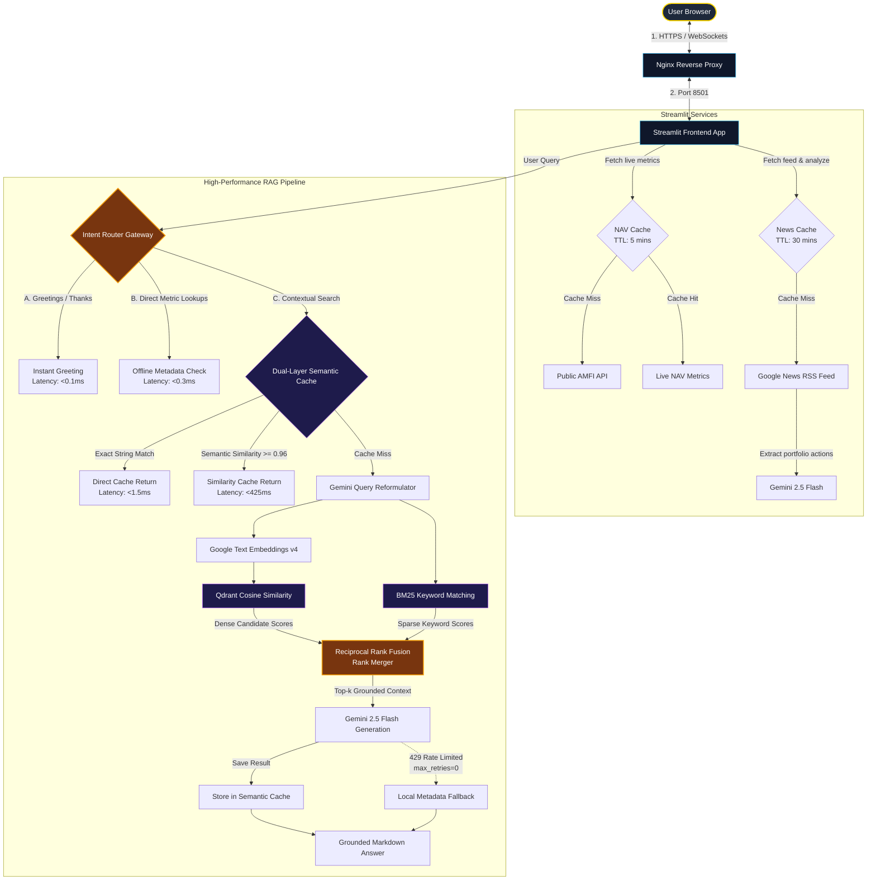

# 🏛️ ArthaAI System & Code Architecture

This document visually details the directory layout and the high-performance retrieval and serving pipelines implemented in the **ArthaAI Mutual Fund RAG Assistant**.

---

## 🏎️ 1. Runtime Request & RAG Data Flow

The diagram below maps how user inputs travel through the frontend, optimization gateways, hybrid retrieval engines, and AI generation layers.

---

## 🗂️ 2. Physical File & Directory Architecture

The folder structure below maps the components on disk to their responsibilities in the architecture.

```mermaid
graph TD
    Root[mf-rag-assistant/] --> App[app.py <br/> Streamlit Dashboard & Chat UI]
    Root --> Docker[Dockerfile & docker-compose.yml <br/> Turnkey Production Containers]
    Root --> NginxConf[nginx_streamlit.conf <br/> Reverse Proxy / WS Upgrades]
    
    Root --> Src[src/ <br/> Core Modules]
    Src --> Config[config.py <br/> Constants & Chunk Limits]
    Src --> Ingest[ingest.py <br/> Ingestion & Qdrant Index creation]
    Src --> QueryEngine[query_engine.py <br/> Hybrid Search, RRF, Intent Router]
    Src --> Cache[semantic_cache.py <br/> Dual-Layer Caching Engine]
    Src --> Metadata[fund_metadata.py <br/> Offline Holdings & Fund Metrics]
    Src --> Utilities[utils.py & nav_service.py <br/> PDF Parsing & Concurrent Live NAV API]
    Src --> NewsService[news_service.py <br/> Google News RSS & Gemini Extraction]
    
    Root --> Data[data/ <br/> Scheme Factsheets]
    Data --> SBI[sbi_bluechip/ <br/> factsheet.pdf & returns_and_expenses.txt]
    Data --> PPF[parag_parikh_flexi/ <br/> factsheet.pdf]
    Data --> OtherFunds[...]
    
    Root --> VectorStore[vector_store/ <br/> Databases & Local Backups]
    VectorStore --> SQLite[qdrant_local/ <br/> Local file-backed Qdrant DB]
    VectorStore --> JsonCache[semantic_cache.json <br/> Serialized Cache Entries]
```

