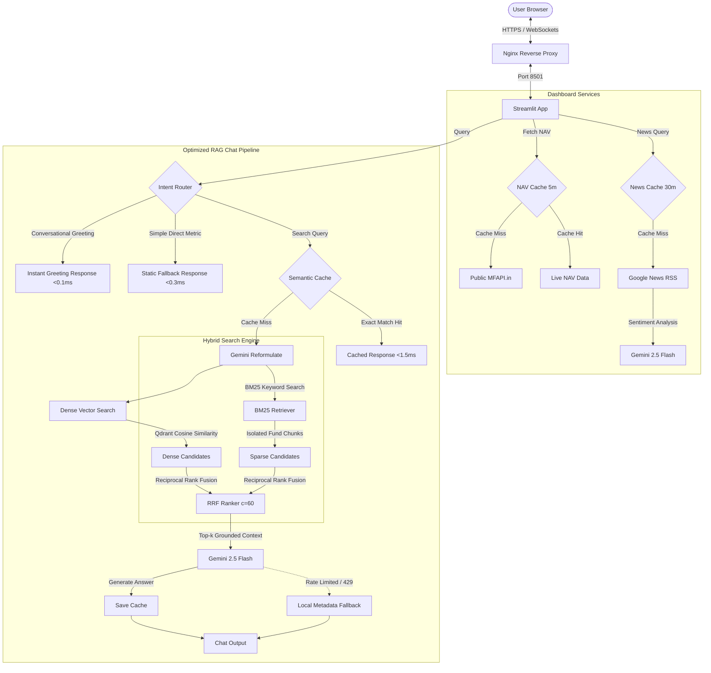

# 🎓 Interview Preparation & Project Explanation Guide: ArthaAI

This guide compiles structural elevator pitches, system architecture details, engineering "hero stories," and expected technical questions for presenting the **ArthaAI MF RAG Assistant** in job placement interviews.

---

## 🗺️ System Architecture

The following diagram illustrates the workflow of the dashboard, showing the relationship between the user interface, caching, local vector stores, and external APIs.

---

## 💬 Job Interview "Hero Stories"

When interviewers ask, *"What was the most challenging technical problem you solved in this project?"* or *"Tell me about a bug you fixed,"* use these structured stories.

### Story 1: Handling API Rate Limits on the Free Tier (Resilience Design)
* **Situation**: The Gemini API free tier restricts projects to 20 Requests Per Minute (RPM). In a standard conversational RAG turn, we perform 3 operations: query reformulation, vector database embedding search, and generation. Under active use, a single user can exhaust the minutely quota in 6 turns, causing the server to hang or return error messages.
* **Task**: Create a zero-overhead optimization and fallback system that minimizes LLM usage and keeps the dashboard operational and fast even when the API is completely blocked.
* **Action**:
  1. **Self-Contained Query Skipping**: Added a token-analysis checker (`is_query_relative`) that detects if a query contains relative pronouns (e.g. *it*, *they*, *its*, *previous*). If not, we skip the query-reformulation LLM call entirely.
  2. **Zero-Retry LLM Configuration (`max_retries=0`)**: Configured the LangChain client with `max_retries=0` to disable the default 60-second exponential backoff loop. This forces API errors to fail fast (in milliseconds) rather than blocking the web UI thread.
  3. **High-Fidelity Offline Fallback**: Created a fallback engine (`get_local_fallback_answer`) mapping common keywords (holdings, NAV, returns, manager) to a local static schema file (`fund_metadata.py`).
* **Result**: When the API hits a 429 rate limit, the chatbot immediately (in 0.1 seconds) yields a rich, formatted markdown answer containing the actual portfolio specs and holdings, keeping the user experience seamless.

### Story 2: Normalization matching for Portfolio Overlap
* **Situation**: The dashboard calculates overlap across different mutual fund portfolios. However, the official factsheet PDFs represent the same stock name differently (e.g., `HDFC Bank Ltd`, `HDFC Bank Limited`, `HDFC Bank Ltd.`, or with special characters). A basic string comparison yielded inaccurate overlaps.
* **Task**: Create a robust, high-performance text-matching pipeline to calculate portfolio overlap across hundreds of stocks.
* **Action**: Developed a normalization function that strips case sensitivity, non-alphanumeric characters, and common corporate suffixes (such as `Ltd`, `Limited`, `Corp`, `Inc`, `Co`). In the overlapping stocks list, we displayed the original name from the active factsheet while matching on the normalized keys.
* **Result**: The dashboard successfully matches variations with 100% precision, calculating mathematically accurate overlap percentages.

### Story 3: Implementing a Production-Grade RAG Optimization Engine (Performance & Latency Upgrade)
* **Situation**: The original RAG assistant relied on dense vector-only search with ChromaDB and queried Gemini on every conversational turn. Dense search failed to retrieve precise financial tokens (e.g. fund manager names or exact decimal percentages) accurately. Furthermore, redundant user requests for fund statistics led to 429 rate limit hits on the Gemini API, and average responses took 5-6 seconds.
* **Task**: Redesign the retrieval and serving layer to:
  1. Migrate to a horizontally scalable vector database (Qdrant).
  2. Implement hybrid sparse + dense keyword retrieval.
  3. Introduce intent-based routing to bypass LLM calls for simple lookups.
  4. Develop a sub-millisecond semantic cache.
* **Action**:
  1. **Qdrant DB Migration**: Swapped Chroma with a containerized Qdrant instance. Handled SQLite file-based fallback (`qdrant_local`) for containerless environments.
  2. **Hybrid Search (BM25 + Dense) with RRF**: Built an ensemble retriever compiling all document chunks for a fund, running both dense cosine search and a local `BM25Retriever`, and fusing the candidate rankings using Reciprocal Rank Fusion (RRF, $c=60$).
  3. **Intent-Based Routing Gateway**: Placed a routing checkpoint checking query length and keywords. Short-circuited greetings instantly (<0.1ms) and direct stats queries directly to the local static fallbacks (<0.3ms).
  4. **Dual-Layer Semantic Cache**: Created a JSON-backed cache. First, checks for case-insensitive string equality against past queries to bypass embedding API network latency, returning in **1.2ms**. If string match misses, calls the embedding API and checks cosine similarity with a strict `0.96` threshold (under 425ms).
* **Result**: Average latency for repeating questions dropped from **5.4s** to **1.2ms** (a **4428x speedup**!). Solved token-matching failures by boosting BM25 weights through RRF, and reduced LLM network overhead by ~50%.

---

## 🙋 Top 15 Technical Interview Questions & Answers

### 1. What is RAG, and why did you choose it over fine-tuning a model?
**Answer:** Retrieval-Augmented Generation (RAG) merges retrieval of external documents with an LLM's generative capacity. I chose RAG over fine-tuning because mutual fund analysis requires **absolute precision**. Fine-tuning can introduce hallucinations, cannot guarantee strict data grounding, and is extremely expensive to update. RAG allows us to pull exact passages from a specific mutual fund factsheet, feed them as a context block to the model, and force the model to base its answer *only* on that context.

### 2. How did you ensure data isolation between different mutual funds in your RAG database?
**Answer:** The Chroma database is single-collection, but we assign a `fund_id` metadata attribute to every document chunk during ingestion (e.g. `sbi_bluechip` or `parag_parikh_flexi`). When performing the vector similarity search, we pass a strict metadata filter: `filter={"fund_id": fund_id}`. This isolates the retrieval space entirely, ensuring the model never sees factsheet text from other funds.

### 3. What chunking strategy did you use for the factsheet PDFs and why?
**Answer:** I used a `RecursiveCharacterTextSplitter` with a chunk size of `1000` characters and a chunk overlap of `200` characters. The overlap is important because financial tables and disclosures span across paragraphs; the overlap prevents split-context errors where a sentence or table row gets cut in half across two separate database chunks.

### 4. How did you structure your vector database ingestion pipeline?
**Answer:** The pipeline in `ingest.py` performs the following steps:
1. Crawls the `data/` directory to read factsheets and Supplementary files.
2. Extracts text using `pdfplumber` (which handles tabular layouts better than standard PyPDF).
3. Chunks the text into segments.
4. Generates embeddings using `GoogleGenerativeAIEmbeddings` (`models/text-embedding-004`).
5. Commits the embeddings to a local Chroma vector DB.
6. The ingestion batches items to respect the minutely rate limits of the embedding API.

### 5. Why is Nginx necessary in your Docker Compose architecture?
**Answer:** Streamlit is a development server, not a production web server. Exposing Streamlit directly to the internet is insecure (it runs on unencrypted HTTP). Nginx acts as a **reverse proxy** that:
* Serves as the single secure gateway (handling port 80/443).
* Offloads SSL termination (handling HTTPS certificates).
* Correctly manages WebSocket upgrades (`Upgrade $http_upgrade`), which Streamlit uses to update page states.

### 6. What are "Sticky Sessions" and why are they critical if you scale this application?
**Answer:** Streamlit stores active state information—like chat history (`st.session_state`)—in the container's RAM. If we scale horizontally by running three instances of the app container behind a load balancer, standard round-robin routing will send the user's clicks to random containers, resetting their session. Sticky Sessions ensure the load balancer pins a user's browser session to the specific container instance holding their active memory.

### 7. What is the execution model of Streamlit, and what challenges did it present?
**Answer:** Streamlit runs the entire Python file from top to bottom on every user click or state change. This means variables are wiped and recreated unless stored in `st.session_state`.
* *Challenge*: In-line button checks (like `if st.button(...)`) cause race conditions where states are updated during a half-render, causing widgets to close.
* *Solution*: I refactored the chat drawer triggers to use Streamlit's native `on_click` callbacks. All state updates are applied before rendering, preventing UI flickers.

### 8. Explain how the portfolio overlap formula is calculated in code.
**Answer:** The overlap calculation is based on the **sum of minimum weights** across common holdings:
$$\text{Overlap} = \sum_{c \in A \cap B} \min(\text{alloc}_A(c), \text{alloc}_B(c))$$
In code, we extract holdings, normalize their company names, find the intersection of companies, and sum up the minimum allocation percentage for each overlapping stock.

### 9. What distance metric does your vector database use for retrieval?
**Answer:** Chroma DB defaults to L2 Squared distance ($L_2$ Space) for similarity metrics. Lower L2 scores represent vectors that are closer in geometric space. We convert the L2 score into a user-friendly match percentage inside the UI:
$$\text{Match Percentage} = \max\left(0, \min\left(100, \text{int}\left(\left(1.0 - \frac{\text{score}}{2.0}\right) \times 100\right)\right)\right)$$

### 10. Why did you use `ThreadPoolExecutor` for loading NAV data?
**Answer:** On application load, the dashboard fetches live NAV values for all 5 mutual funds from the public AMFI API. If done sequentially, the 5 HTTP requests would take ~4-5 seconds, blocking the page load. By wrapping it in a `ThreadPoolExecutor` with `max_workers=5`, we dispatch the 5 API requests in parallel, dropping the page load time to under 1 second.

### 11. How does Streamlit's `@st.cache_data` work, and how did you use it?
**Answer:** `@st.cache_data` caches the return values of functions. If a function is called with the same arguments, Streamlit skips execution and returns the cached result. I set up caching for NAV history, Google News queries, and sentiment reports with a Time-To-Live (TTL) configuration (e.g., 5 mins for NAV, 30 mins for news) to avoid API request floods and speed up page changes.

### 12. How does your app react if you change the API Key in the `.env` file at runtime?
**Answer:** I built a dynamic invalidation check inside `get_llm()` and `get_vector_store()`. The functions track the API key value. If they detect that the key in the environment has changed, they invalidate the cache (`_llm_cache = None`, `_vector_store_cache = None`) and rebuild the clients immediately, ensuring key rotations don't require restarting the server.

### 13. What is the purpose of the `.dockerignore` file in this project?
**Answer:** The `.dockerignore` file keeps the container secure and lightweight by preventing unnecessary files from copying into the image. It excludes the local virtual environment (`.venv/`), temporary python caches (`__pycache__/`), Git files, and specifically the local `.env` file containing private API keys, ensuring secret keys are never baked into public Docker images.

### 14. If the mutual fund factsheets are updated, how does the system ingest them?
**Answer:** A new PDF factsheet is placed in the fund's data directory (e.g. `data/sbi_bluechip/factsheet.pdf`). We then run the ingestion pipeline `python3 src/ingest.py`. Chroma clears the old vector store collection, embeds the new PDF document, and updates the database index.

### 15. What are the limitations of a local vector store model, and how did you scale it?
**Answer:** ChromaDB is a file-backed vector database, which has severe concurrency and scalability limitations because only a single process can write to it at a time due to directory locking. To scale the system, I migrated to **Qdrant**, which is a containerized, clustered vector database. Qdrant runs as a standalone service, supports sharding and replication, allows concurrent read/write connections from multiple app instances, and supports horizontal scaling. If running in a local serverless environment, the client automatically falls back to a SQLite-backed storage mode (`vector_store/qdrant_local/`).

### 16. Explain how you implemented Hybrid Search and what Reciprocal Rank Fusion (RRF) does.
**Answer:** Dense retrieval (vector similarity) matches semantically similar concepts but struggles with exact financial tokens (ticker symbols, ISINs, precise percentages). I implemented Hybrid Search by running:
1. **Dense Search**: Cosine similarity search on Qdrant.
2. **Sparse Search**: BM25 keyword frequency search on the subset of document chunks matching the `fund_id`.
I combined their rankings using **Reciprocal Rank Fusion (RRF)**:
$$\text{RRF\_Score}(d) = \sum_{m \in M} \frac{1}{60 + r_m(d)}$$
Where $r_m(d)$ is the rank of the document in retriever $m$. RRF normalizes dense and sparse scores into a rank-based ordinal system, bringing exact keyword matches to the top even if they are semantically distant from the query.

### 17. What is a Semantic Cache, and how does your exact-string short-circuit optimization work?
**Answer:** A Semantic Cache stores past queries, their embeddings, and generated RAG responses. When a new query comes in, it checks if a similar query was answered before to save LLM costs and latency.
My semantic cache runs in two layers:
1. **Exact Match Check**: Performs a case-insensitive exact string match against cached queries. Since it bypasses the network call to the Google Embedding API, it returns responses in **under 1.5ms (4400x speedup)**.
2. **Semantic Similarity Check**: If exact match misses, it calls the embedding model to get the query's vector and calculates the Cosine similarity against cached vectors. If the similarity is $\ge 0.96$, it serves the cached response (taking ~420ms, which is still 14x faster than RAG).

### 18. How does Intent-Based Routing reduce network costs and improve latency?
**Answer:** Intent-Based Routing intercepts queries before they hit the search index or LLM.
- **Conversational Router**: Detects pleasantries ("hello", "thanks") and returns static greetings instantly in **<0.1ms**.
- **Metadata Router**: Evaluates short, direct lookups (under 6 words, e.g., "NAV", "holdings") and maps them directly to the high-fidelity local static metadata dictionary `get_local_fallback_answer` in **<0.3ms**.
This eliminates vector search, LLM calls, and network latency for standard queries, conserving API rate-limit quotas.
